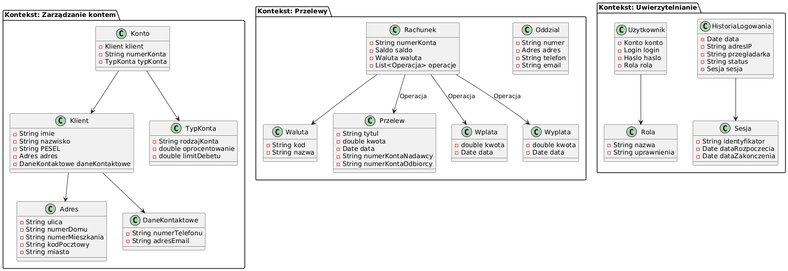

# Domain Driven Design

Celem zadania jest zamodelowanie fragmentu bezpiecznej aplikacji bankowej, wykorzystując zasady Domain Driven Design. Jest to podejście do projektowania oprogramowania, które skupia się na modelowaniu dziedziny problemu zamiast technicznych aspektów implementacji. Tworzona aplikacja ma umożliwiać zarządzanie kontami bankowymi, w tym tworzenie nowych kont, wpłaty, wypłaty, przelewy między kontami oraz sprawdzanie stanu konta.

## Zdefiniowanie kontekstów

Konteksy (bounded contexts) to wydzielone obszary dziedziny problemu, które posiadają swoje własne zasady, język i modele.

W modelowanej aplikacji bankowej wyróżniamy następujące konteksty:
- Zarządanie kontem: Kontekst odpowiedzialny za obsługę konta bankowego i zarządzanie danymi klienta.
- Przelewy: Kontekst odpowiedzialny za realizację przelewów.
- Uwierzytelnianie: Kontekst odpowiedzialny za uwierzytelnianie klienta i zarządzanie dostępem do konta.

## Modelowanie agregatów, encji i obiektów wartości

Agregaty to grupy powiązanych ze sobą encji i obiektów wartości, które są traktowane jako jedność w kontekście transakcji. Agregaty posiadają korzeń, który jest jedynym punktem dostępu do pozostałych obiektów wewnątrz agregatu - encji i obiektów wartości. Encje to obiekty, które posiadają unikalny identyfikator i mogą zmieniać się w czasie. Obiekty wartości to obiekty, które nie posiadają unikalnego identyfikatora i są niezmienne.

W modelowanej aplikacji bankowej wyróżniamy następujące agregaty, encje i obiekty wartości:
- Kontekst: Zarządzanie kontem
    - Agregat: Konto
        - Encja: Konto
        - Encja: Klient
        - Obiekt wartości: Adres
        - Obiekt wartości: Dane kontaktowe
        - Obiekt wartości: Typ konta
- Kontekst: Przelewy
    - Agregat: Rachunek
        - Encja: Rachunek
        - Encja: Oddział
        - Obiekt wartości: Waluta
        - Obiekt wartości: Przelew
        - Obiekt wartości: Wpłata
        - Obiekt wartości: Wypłata
- Kontekst: Uwierzytelnianie
    - Agregat: Użytkownik
        - Encja: Użytkownik
        - Obiekt wartości: Rola
        - Obiekt wartości: Historia logowania
        - Obiekt wartości: Sesja

Kontekst: Zarządzanie kontem
| Typ | Nazwa | Atrybuty |
| --- | --- | --- | --- |
| Encja | Konto | Klient, Numer konta, Typ konta |
| Encja | Klient | Imię, Nazwisko, PESEL, Adres, Dane kontaktowe |
| Obiekt wartości | Adres | Ulica, Numer domu, Numer mieszkania, Kod pocztowy, Miasto |
| Obiekt wartości | Dane kontaktowe | Numer telefonu, Adres e-mail |
| Obiekt wartości | Typ konta | Rodzaj konta, Oprocentowanie, Limit debetu |

Kontekst: Przelewy
| Typ | Nazwa | Atrybuty | Opis |
| --- | --- | --- | --- |
| Encja | Rachunek | Numer konta, Saldo, Waluta, Operacje |
| Encja | Oddział | Numer, Adres, Telefon, E-mail | Oddział banku |
| Obiekt wartości | Waluta | Kod, Nazwa |
| Obiekt wartości | Przelew | Tytuł, Kwota, Data, Numer konta nadawcy, Numer konta odbiorcy |
| Obiekt wartości | Wpłata | Kwota, Data |
| Obiekt wartości | Wypłata | Kwota, Data |

Kontekst: Uwierzytelnianie
| Typ | Nazwa | Atrybuty | Opis |
| --- | --- | --- | --- |
| Encja | Użytkownik | Konto, Login, Hasło, Rola |
| Obiekt wartości | Rola | Nazwa (Klient/Pracownik/Administrator), Uprawnienia  |
| Obiekt wartości | Historia logowania | Data, Adres IP, Przeglądarka, Status, Sesja |
| Obiekt wartości | Sesja | Identyfikator sesji, Data rozpoczęcia, Data zakończenia |

## Zdefiniowanie przyjętych założeń

W trakcie modelowania aplikacji bankowej przyjęto następujące założenia:
- Klient banku w momencie rejestracji podaje swoje dane osobowe, które są przechowywane w systemie bankowym.
- Numer konta bankowego składa się z 26 cyfr w formacie NRB. Numer konta jest unikalny w skali całego banku.
- Saldo konta bankowego nie może być ujemne. W przypadku braku wystarczających środków na koncie, operacja wypłaty lub przelewu nie zostanie wykonana.
- Operacje na koncie bankowym, takie jak wpłaty, wypłaty, przelewy, są wykonywane w czasie rzeczywistym.
- Każda operacja jest zapisywana w historii operacji. Historia operacji na koncie bankowym jest niezmienialna i chroniona przed modyfikacją.
- Operacje na koncie bankowym są zgodne z zasadami rachunkowości (suma sald operacji jest równa saldu konta).
- Klient może sprawdzić stan konta bankowego w dowolnym momencie.
- Konto klienta jest chronione przed nieuprawnionym dostępem. Aby uzyskać dostęp do konta, klient musi uwierzytelnić się za pomocą loginu i hasła.
- Po zalogowaniu dane sesji są przechowywane w systemie bankowym. Sesja jest ważna przez określony czas, po którym wygasa. Sesja może być zakończona przez klienta lub automatycznie po upływie czasu ważności.
- Klient może zablokować konto bankowe w przypadku utraty karty płatniczej lub podejrzenia nadużycia. Zablokowanie konta uniemożliwia wykonanie operacji na koncie.
- Klient może zlecić zamknięcie konta bankowego w dowolnym momencie.
